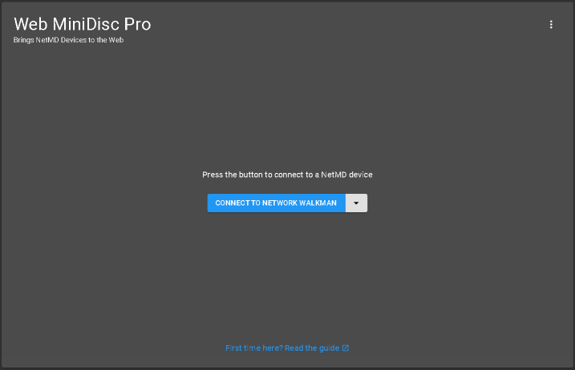
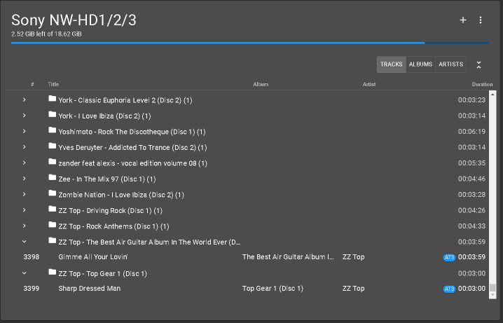
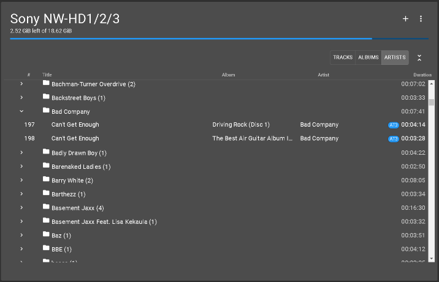
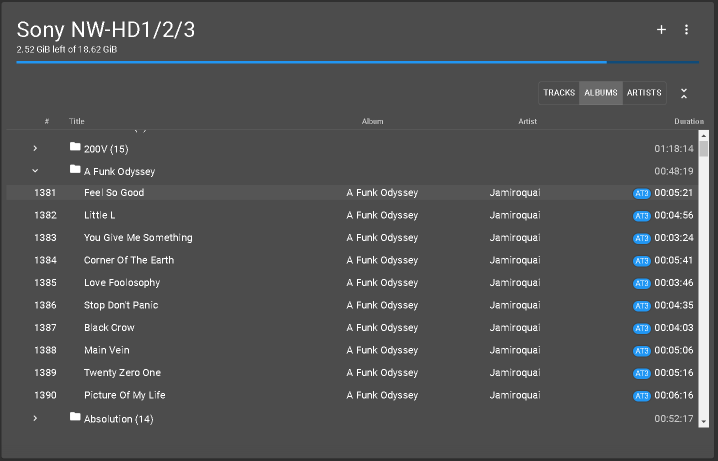
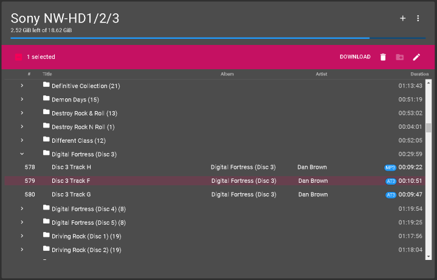
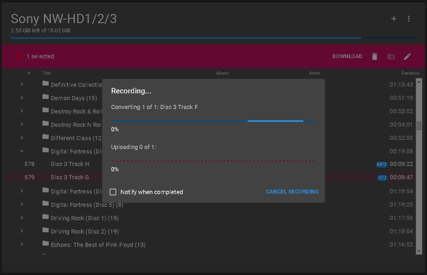

Sony NW-HD1/2/3 Music Manager

A modern Windows application for managing music on the Sony NW-HD1 Network Walkman without needing Sony SonicStage.
Built as a fork of Electron [Web MiniDisc Pro] (https://github.com/asivery/webminidisc), with additional development focused on the NW-HD1.

✨ Features

🎵 Upload music to your NW-HD1  
📥 Download music from your NW-HD1  
🗑️ Delete tracks  
✏️ Edit track metadata  
📚 Browse your library by Tracks, Albums or Artists  
🔍 Manage large music libraries efficiently  
💾 Designed for Windows  
🚫 No SonicStage required

📥 Download



















Windows users: you don't need to build anything.
Download the latest Windows release from the Releases page, run the executable, connect your NW-HD1 and start managing your music.
Download the latest Windows release

🎧 Supported devices

The application has been specifically developed and tested with the Sony NW-HD1.
The application also correctly identifies the NW-HD2 and NW-HD3, which share Sony's USB product ID.
As this is a fork of Electron [Web MiniDisc Pro] this may well work with other Sony Network Walkman devices.

Why?

The NW-HD1 is still a fantastic little music player, but its original software, SonicStage, makes using it on a modern Windows PC unnecessarily difficult. This project aims to give the NW-HD1 a simple, modern Windows interface while keeping the original hardware alive.

⚠️ Important

This is an unofficial community project and is not affiliated with Sony.
Always keep a backup of important music before making changes to an old device.

🛠️ For developers

This project is based on Electron Web MiniDisc.
The Electron application is contained in this repository, while the renderer and device functionality are maintained in the accompanying Web MiniDisc fork.
See the development instructions below if you want to build the application yourself.

## This fork (Sean Townsend)

This is a fork of [asivery/ElectronWMD](https://github.com/asivery/ElectronWMD), built for use with a Sony NW-HD1 Network Walkman. The `webminidisc` submodule points at [Sean-Townsend/webminidisc](https://github.com/Sean-Townsend/webminidisc) rather than the original, since most of the changes live there.

### v2.0.0

**New features**
- Track list is now virtualized (only visible rows are ever mounted), fixing severe scrolling lag on large libraries (3000+ tracks)
- Added Tracks / Albums / Artists view modes. Albums/Artists are re-grouped from each track's own tags rather than the device's stored group boundaries, which fixes albums getting fragmented into many single-track groups when tagging is slightly inconsistent between tracks (e.g. different casing/whitespace in the album tag)
- Albums/artists are collapsible, with collapse state tracked separately per view mode and defaulting to fully collapsed on a fresh connection
- Added a confirmation dialog before ungrouping an album, worded accurately for devices where groups are virtual (e.g. Network Walkman) vs real (NetMD/HiMD)

**Fixes**
- Fixed collapsed albums silently re-expanding after deleting, renaming, or uploading tracks
- Fixed the album collapse/delete buttons sometimes doing nothing on click - caused by `react-dropzone`'s keyboard focus tracking intercepting the click event before it reached the button
- Fixed track numbers being clipped to a single digit on devices with more than 9 tracks
- Fixed the "Title" column header not lining up with the actual track/album title text
- Fixed the upload button floating over the last track in the list (moved it into the toolbar)
- Fixed the playback transport bar showing a misleading "ready to play" state on devices that don't support remote playback control (it's now hidden entirely on those devices)
- Fixed Sony NW-HD1, NW-HD2, and NW-HD3 all being labelled "NW-HD3" - Sony reused the same USB product ID across all three models
- Fixed a Windows-specific bug in the Electron main process where loading `index.html` via string-concatenated `file://` URLs broke on Windows-style backslash paths (`Not allowed to load local resource`) - fixed to use `pathToFileURL`
- Fixed `run-fixes.sh`'s `uname` detection not recognizing Git Bash/MSYS2/Cygwin on Windows
- Fixed packaging (`electron-builder`) failing on Windows when it tried to download macOS code-signing tools it doesn't need
____

## Note for users only

If you're not a developer, and are just looking for a pre-built app, you can download it from the [releases section](https://github.com/asivery/ElectronWMD/releases).

MacOS users might need to run some Terminal commands for the app to work due to Apple's restrictive security policies. These commands are listed from [here](#de-quarantine-the-application) onwards.


## Building
The project consists of two parts:
- The main electron code
- The renderer (GUI) code (The Web MiniDisc project itself)

This repository contains only the main electron app.
Upon building, it will clone the renderer repository (this fork uses [https://github.com/Sean-Townsend/webminidisc](https://github.com/Sean-Townsend/webminidisc), branch `sean-townsend-changes` - see `.gitmodules`), and build that too.

You can:
- Install node modules (`npm i`) (the `--legacy-peer-deps` switch might be required for newer node.js versions)
- Start the development version (`npm start`)
- Deploy the production version (`npm run dist`)
- Deploy the production versions for macOS (`npm run dist-mac`)
____

### Important development changes

Because of Web Minidisc Pro's reliance on older versions of packages such as React and material-ui, you might need to change

```
npm i
```

to

```
npm i --legacy-peer-deps
```

in `build-renderer.sh` depending on your node.js version.

### Development on macOS
#### Install Xcode Build Tools CLI & Homebrew

Make sure Xcode Build Tools CLI & Homebrew are properly installed - in the Terminal run:
- `xcode-select install` - to install XCode Command Line Tools
- `/bin/bash -c "$(curl -fsSL https://raw.githubusercontent.com/Homebrew/install/HEAD/install.sh)"` - to install Homebrew

#### Install gcc & libvips

In macOS Terminal: `brew install --build-from-source gcc`, wait for it to finish then run `brew install vips` (this command may install gcc again from an available pre-built binary, if one exists for your current macOS version, this is normal behaviour as gcc is needed for vips to work).

#### Build
Assuming you've completed the above steps, you should be able to follow the standard procedure - run:

- `npm i --legacy-peer-deps` to install the dependencies
- `npm run dist-mac` to create the binary packages

#### De-quarantine the application
(For users unfamiliar, the following commands may also need Xcode CLI installed, so start with [this](#install-xcode-build-tools-cli--homebrew), then return to this step.)

To de-quarantine the app on macOS run the following command in the terminal:

- `xattr -d com.apple.quarantine "/path/to/your.app"`

#### Sign the binary

To codesign the local binary with a self-signing certificate run:

- `codesign --sign - --force --deep "/path/to/your.app"`

This should be all that is needed, enjoy the application.
____

## Final thoughts

Should you run into any issue, you can, of course, open a new issue on this github or reach out to any of the current contributors via the [MiniDisc.wiki Discord](https://minidisc.wiki/discord) in the #research or #software-help channels


Many thanks to [cybercase](https://github.com/cybercase) for writing the original Web MiniDisc and letting so many people experience this forgotten format again.